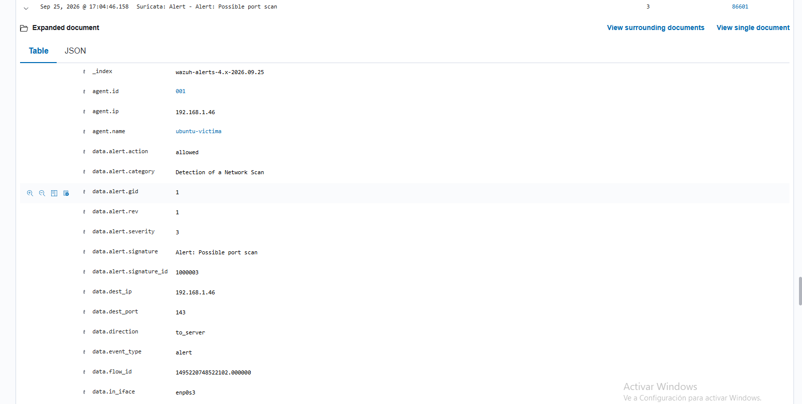
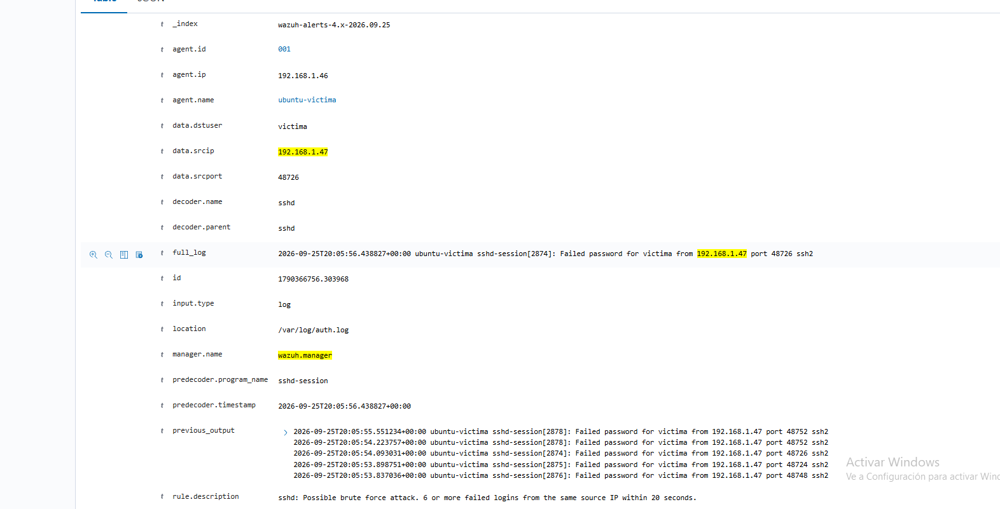
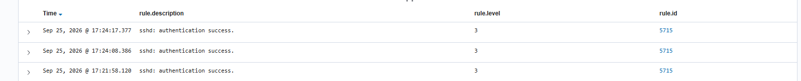
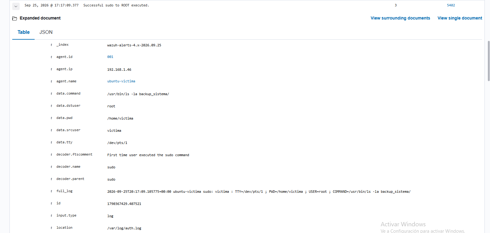
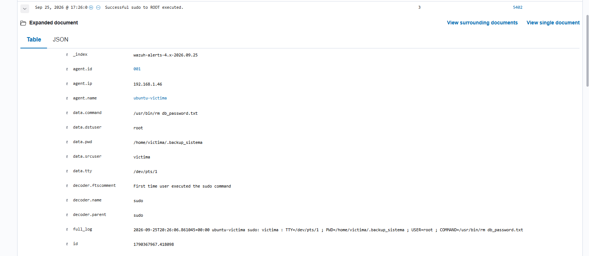
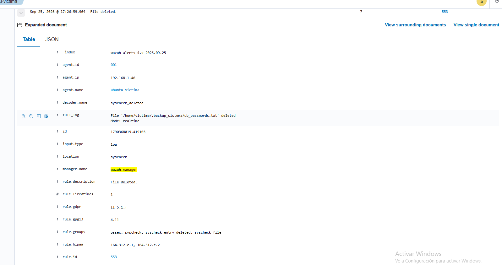

# Case 01: SSH Brute Force + Data Exfiltration

    

---

## Case at a Glance

| Field | Detail |
|---|---|
| **Victim host** | `ubuntu-victima` (192.168.1.46) |
| **Attacker host** | Kali Linux (192.168.1.47) |
| **Compromised user** | `victima` |
| **Severity** | High |
| **Initial artifact** | Port scan (nmap SYN scan) |
| **Telemetry sources** | Suricata (NIDS) + Wazuh (HIDS/SIEM) + FIM |
| **Key behaviors** | Reconnaissance, SSH brute force, valid access, discovery, exfiltration, anti-forensics |
| **Detections generated** | 3 (Suricata) + 3 (Wazuh native + custom) + 1 (FIM) + 1 (TheHive auto-case) |
| **Tools** | Suricata, Wazuh, TheHive, Cortex, Hydra, nmap |

---

## Attack Flow

```
Reconnaissance           SSH Brute Force            Valid Access
(nmap -sS)          →    (Hydra, wordlist)     →    (real password found)
     ↓ Suricata                ↓ Suricata/PAM/            ↓ sshd + PAM
   rule 86601                  custom rule 100010

Valid Access   →   Discovery/Collection   →   Exfiltration   →   Anti-forensics
                    (ls -la, sudo)             (real scp)         (rm file)
                    ↓ visible ONLY             ↓ INVISIBLE         ↓ FIM detects it
                    when sudo is used          (encrypted SSH)     (rule 553)
                    (rule 5402)
```

---

## Contents

1. [Overview](#overview)
2. [Scenario](#scenario)
3. [Objectives](#objectives)
4. [Executive Summary](#executive-summary)
5. [Data Sources](#data-sources)
6. [Raw Event Timeline](#raw-event-timeline)
7. [Investigation](#investigation)
8. [Indicators of Compromise (IOCs)](#indicators-of-compromise-iocs)
9. [Indicators of Attack (IOAs)](#indicators-of-attack-ioas)
10. [MITRE ATT&CK Mapping](#mitre-attck-mapping)
11. [Incident Severity](#incident-severity)
12. [Incident Response Actions](#incident-response-actions)
13. [Detection Rules](#detection-rules)
14. [Final Incident Conclusion](#final-incident-conclusion)
15. [Skills Demonstrated](#skills-demonstrated)
16. [Disclaimer](#disclaimer)

---

## Overview

This case documents a full attack chain executed end-to-end against a personal home lab: network reconnaissance, brute forcing an exposed SSH service, gaining access with weak credentials, discovering a sensitive file, exfiltrating it, and then attempting to delete the evidence (anti-forensics). Every action below — traffic and commands alike — was carried out live against a real victim machine, with detection monitored in real time as it happened.

## Scenario

- **Victim host**: `ubuntu-victima`, Ubuntu Server 22.04, IP `192.168.1.46`. Runs Suricata (NIDS) and the Wazuh agent.
- **Attacker host**: Kali Linux, IP `192.168.1.47`.
- **Wazuh manager**: Docker container (`wazuh-docker/single-node`) on a separate Windows PC.
- **SOAR**: TheHive + Cortex + Elasticsearch, on a third VM (`192.168.1.49`).
- **Target user**: `victima`, with a weak password (`victima:victima` — identical to the username) as the password-policy vulnerability.
- **Sensitive asset**: `db_passwords.txt`, inside `/home/victima/.backup_sistema/`, with correct file permissions (600) but an overly permissive containing folder (775).
- **Trigger event**: inbound port scan detected by Suricata at 17:04:46.

## Objectives

1. Reconstruct the full attack timeline by correlating evidence from Suricata, Wazuh (HIDS/FIM/PAM/sudo), and TheHive.
2. Identify Indicators of Compromise (IOCs) and Indicators of Attack (IOAs).
3. Map every phase to MITRE ATT&CK techniques.
4. Document the visibility blind spots found (what the current stack does NOT detect, and why).
5. Validate a custom detection rule (Wazuh rule 100010) and a SOAR auto-response integration.
6. Propose containment, mitigation, and detection improvements.

## Executive Summary

On 25/09/2026, between 17:04 and 17:27, a full attack chain was executed against the `ubuntu-victima` host. The attacker ran a port scan (detected by Suricata), followed by an SSH brute-force campaign (detected across three independent layers: Suricata, Wazuh's native rule, and a custom rule). The attacker gained valid access by exploiting a weak password, navigated the filesystem until finding a sensitive credentials file, exfiltrated it via `scp`, and then attempted to delete the original.

The exfiltration itself (encrypted `scp` traffic) and the file discovery (commands run without elevated privileges) turned out to be **invisible** to the current detection stack — a blind spot documented in this report. The file deletion, however, was caught by File Integrity Monitoring (FIM), which acted as an independent safety net separate from the rest of the authentication-log-based detection chain.

Severity is classified as **High**: there was confirmed exfiltration of sensitive data using real credentials, even though this took place in a controlled lab environment.

## Data Sources

| Source | What it provides |
|---|---|
| Suricata (`eve.json`) | Network traffic — port scan, SSH brute-force patterns at packet level |
| Wazuh — `auth.log` (sshd, PAM, sudo) | Authentication, session open/close, commands run via `sudo` |
| Wazuh — FIM (`syscheck`) | File creation/deletion/modification in `/home/victima/.backup_sistema` (real time) |
| Wazuh — custom rule `100010` | Purpose-built SSH brute-force detection (6+ failures/20s from the same IP) |
| TheHive (Alerts / Cases) | Confirmation that the detection reached the SOAR and was correlated |

## Raw Event Timeline

| Time (local, UTC-3) | Event | rule.id | Level |
|---|---|---|---|
| 17:04:46.158 | Suricata: Possible port scan | 86601 | 3 |
| ~17:05:53 – 17:06:02 | sshd: repeated failed logins / brute-force pattern (6+ failures in 20s, same source IP) | 100010 | 10 |
| 17:17:09.377 | Successful sudo to ROOT executed (`ls -la backup_sistema/`) | 5402 | 3 |
| 17:21:58.120 | sshd: authentication success (session #1) | 5715 | 3 |
| 17:24:08.386 | sshd: authentication success (session #2) | 5715 | 3 |
| 17:24:17.377 | sshd: authentication success (session #3) | 5715 | 3 |
| 17:26:06.861 | Successful sudo to ROOT executed (`rm db_password.txt` — **failed**, wrong filename) | 5402 | 3 |
| 17:26:59.964 | File deleted (FIM, real command run without sudo — **deletion succeeded**) | 553 | 7 |
| ~17:27:00 | TheHive Alert: "Wazuh Alert: File deleted." | — | — |

## Investigation

**Reconnaissance (17:04:46).** A SYN scan (`nmap -sS`) against the victim host generated anomalous traffic flagged by Suricata as "Possible port scan." This is the first sign of hostile activity — typically low-severity noise, but a useful early indicator.


*Suricata alert: `Possible port scan`, rule 86601, source traffic toward `192.168.1.46:143`.*

**SSH brute force (~17:05 – 17:06).** Multiple failed login attempts from the same source IP triggered three independent detection layers: Wazuh's PAM-based native rule (level 10), and the custom rule `100010` built specifically for this pattern (6+ failures in 20 seconds — calibrated because SSH drops the connection after 3 attempts, so a legitimate user reconnecting would take longer than 20s to rack up 6 failures, while Hydra generates them in seconds). This rule is also wired into a SOAR automation: every trigger automatically creates a High-severity Case in TheHive (see the Detection Rules section).


*Wazuh alert showing repeated `Failed password for victima from 192.168.1.47` entries within a 20-second window, matching the brute-force rule description.*

**Valid access (17:21 – 17:24).** Three separate `sshd: authentication success` events were logged from the attacker's IP, corresponding to: (1) an initial login used to navigate the system, (2) a connection that internally opens `scp` for exfiltration, and (3) a third session. It's worth noting this is **not persistence** in the MITRE sense (there's no backdoor or mechanism surviving a reboot) — it's simply multiple short SSH connections from the same origin for different actions.


*Three `sshd: authentication success` events (rule 5715) at 17:21:58, 17:24:08, and 17:24:17.*

**Discovery (partial blind spot).** The command `sudo ls -la backup_sistema/`, run at 17:17:09, was logged in full detail (user, exact command, working directory) because it used `sudo`. This means the attacker had already obtained valid access before this point — earlier than the three authentication events captured above, which correspond to later sessions. It was confirmed experimentally that browsing files **without** `sudo` (a normal `cd`/`ls` as the owning user) leaves no trace at all — a real blind spot in the current stack.


*`sudo ls -la backup_sistema/` executed as root, logged by the sudo decoder (rule 5402) at 17:17:09.*

**Exfiltration (total blind spot).** No event was found in Wazuh corresponding to the `scp` command that transferred `db_passwords.txt` to the attacker machine. SSH/SCP traffic travels end-to-end encrypted, so neither Suricata (at the network level) nor application logs capture the content or the transfer action itself — only the authentication session that originated it is visible.

**Anti-forensics (17:26).** A first deletion attempt via `sudo rm db_password.txt` **failed** (wrong filename, missing the trailing "s") — it appeared in the sudo log precisely because it used elevated privileges. The real, successful deletion was performed with the correct filename, without `sudo` (the user already owned the file) — therefore invisible in `auth.log`, but still caught by the **File Integrity Monitoring (FIM)** module, which operates independently from the command-auditing pipeline. This is the clearest example of defense in depth in this case: one detection layer compensated for another's blind spot.


*Failed deletion attempt: `sudo rm db_password.txt` (wrong filename), rule 5402, at 17:26:06.*


*FIM alert: `File '/home/victima/.backup_sistema/db_passwords.txt' deleted`, rule 553, level 7, at 17:26:59 — the actual, successful deletion.*

## Indicators of Compromise (IOCs)

| Type | Value | Context |
|---|---|---|
| Attacker IP | `192.168.1.47` | Source of all malicious traffic |
| Target user | `victima` | Account compromised via weak password |
| Weak credential | `victima:victima` | Password identical to the username |
| Exfiltrated file | `/home/victima/.backup_sistema/db_passwords.txt` | Contained (simulated) database credentials |
| Attack tool | Hydra (brute force) | Wordlist `passwords.txt` |
| Recon tool | nmap (`-sS`) | SYN scan |

## Indicators of Attack (IOAs)

| Behavior | Why it's suspicious |
|---|---|
| Multiple short SSH sessions (3 in under 3 minutes) from the same IP | Typical pattern of an operator running discrete actions (login, transfer, cleanup) instead of one long normal interactive session |
| Burst of 6+ authentication failures in 20 seconds | Speed incompatible with human typing — indicates an automated tool |
| Failed `rm` command followed seconds later by a successful deletion with the corrected filename | Indicates an operator adjusting their own attack in real time (likely a human or script typo) |
| Access to a folder with open group/other permissions (775) immediately after login | Deliberate search for files accessible beyond the user's own |

## MITRE ATT&CK Mapping

| Phase | Technique | ID | Tactic | Evidence | Confidence |
|---|---|---|---|---|---|
| Reconnaissance | Active Scanning | T1595 | Reconnaissance | Suricata rule 86601 | High |
| Initial Access | Brute Force: Password Guessing | T1110.001 | Credential Access | Wazuh rule 2502 / 100010 | High |
| Discovery | File and Directory Discovery | T1083 | Discovery | Wazuh rule 5402 (sudo) | Medium (only visible with sudo) |
| Collection | Data from Local System | T1005 | Collection | No direct evidence; inferred from context | Medium |
| Exfiltration | Exfiltration Over Alternative Protocol (SSH/SCP) | T1048 / T1041 | Exfiltration | No direct evidence (blind spot); inferred from session correlation | Low-Medium |
| Anti-forensics | Indicator Removal: File Deletion | T1070.004 | Defense Evasion | Wazuh rule 553 (FIM) | High |

## Incident Severity

**Classification: High.**

Rationale: there was confirmed exfiltration of a file containing (simulated) database credentials, using an account with a trivially weak password. While the environment is a controlled lab, the event chain faithfully replicates a real-world compromise scenario of an SSH-exposed Linux server. Scope is limited to a single host and a single account, with no evidence of lateral movement or privilege escalation beyond the compromised user's own legitimate use of `sudo`.

## Incident Response Actions

1. **Containment**: block the source IP at the firewall / Wazuh Active Response level upon rule `100010` firing (pending implementation — see Detection Rules).
2. **Evidence preservation**: export the relevant Wazuh events (`rule.id: 86601, 2502, 100010, 5715, 5402, 553`) and TheHive alerts before any log rotation.
3. **Threat hunting**: search for other accounts with equally weak passwords (`user:user` pattern) across the rest of the infrastructure.
4. **Eradication**: force a password change on the `victima` account; review and fix permissions on `/home/victima/.backup_sistema` (from 775 to 750 or more restrictive).
5. **Recovery**: confirm no additional files remain exposed; restore the file from backup if applicable.
6. **Post-incident**: close the documented blind spots (see conclusion) — evaluate `auditd` for visibility into non-sudo commands, and consider DLP or SSH traffic inspection (bump-in-the-wire) for encrypted exfiltration.

## Detection Rules

**Custom Wazuh rule — ID 100010:**
```xml
<rule id="100010" level="10" frequency="6" timeframe="20" ignore="180">
  <if_matched_sid>5760</if_matched_sid>
  <same_source_ip />
  <description>sshd: Possible brute force attack. 6 or more failed logins from the same source IP within 20 seconds.</description>
  <mitre><id>T1110.001</id></mitre>
</rule>
```
*Goal*: detect SSH brute force faster than the native rule (`5763`, 8 failures/120s). *Validated* with `wazuh-logtest`, fires exactly on the 6th failure.

**SOAR automation (Wazuh → TheHive integration):** when `rule.id: 100010` fires, the integration script (`custom-thehive`) automatically creates a **Case** in TheHive (not just an Alert) with High severity and tags `T1110.001, auto-promoted, ssh, bruteforce` — skipping manual triage for high-confidence detections. *Known limitation*: no deduplication — every rule trigger creates a new Case even if it's the same ongoing attack (pending improvement).

**SIEM-agnostic version**: this rule has been converted to **Sigma** format for portability — see [`detection-rules/sigma/`](../../detection-rules/sigma/).

## Final Incident Conclusion

This case demonstrates the full lifecycle of an SSH brute-force attack with exfiltration, detected and correlated using an in-house NIDS + HIDS + SOAR stack. The investigation revealed both strengths (detection across multiple independent layers for the brute force, FIM acting as a safety net for anti-forensics, a working SOAR automation) and concrete, documented blind spots: commands run without elevated privileges and encrypted traffic (SCP) are invisible to the stack as currently configured. Closing those blind spots (auditd, traffic inspection) remains future work.

## Skills Demonstrated

- Multi-source log analysis (Suricata, Wazuh/PAM/sudo/FIM, TheHive) and manual correlation by time/IP
- Design and validation of a custom detection rule (Wazuh, tested with `wazuh-logtest`)
- SOAR automation (Wazuh→TheHive integration via a Python script, including conditional auto-promotion to Case)
- Real infrastructure troubleshooting: Docker networking, Linux permissions, file encoding (CRLF/BOM), REST API debugging
- Mapping technical evidence to MITRE ATT&CK with explicit confidence levels
- Identifying and documenting visibility blind spots (critical thinking, not just tool execution)
- Writing a professional incident report (SANS PICERL / NIST SP 800-61 style)

## Disclaimer

This is a **real, deliberately executed** incident in an isolated home lab, for educational and portfolio purposes. None of the machines or data involved belong to a third party or a production environment. The "sensitive data" (`db_passwords.txt`) is fictitious, created specifically for this exercise.
