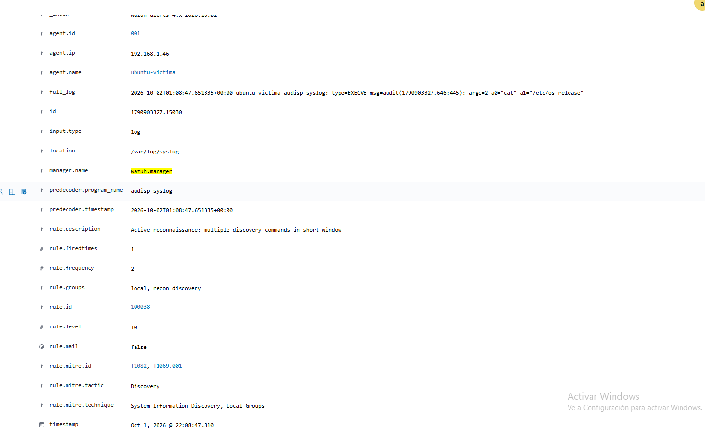
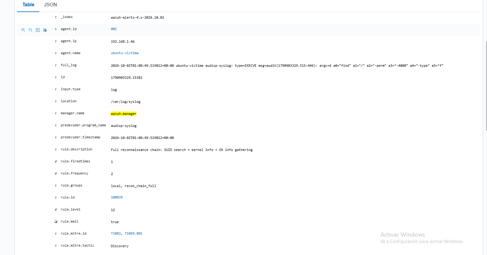
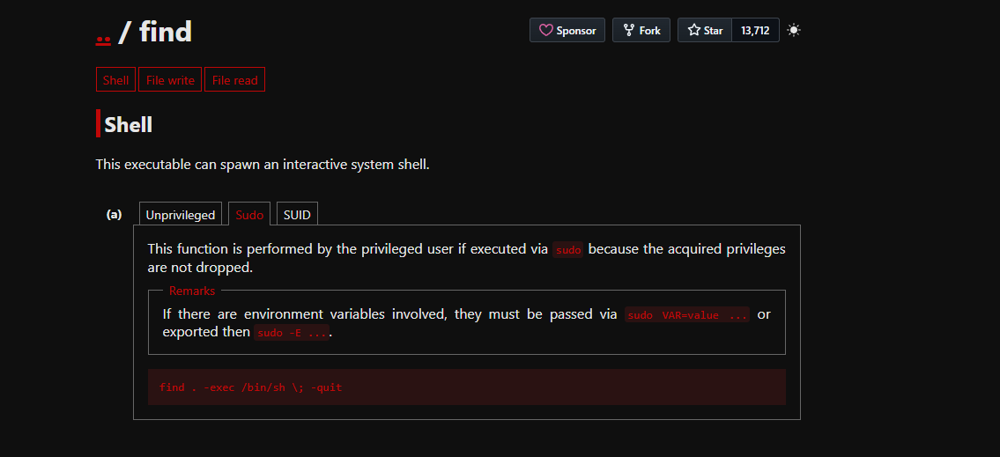
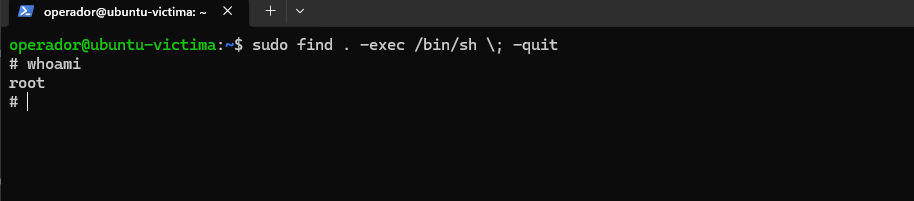
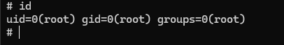

# Case 03: Privilege Escalation — GTFOBins Abuse of a Restricted Sudo Binary

    

---

## Case at a Glance

| Field | Detail |
|---|---|
| **Victim host** | `ubuntu-victima` (192.168.1.46), Ubuntu 26.04 LTS, kernel 7.0.0-31-generic |
| **Compromised user** | `operador` — new low-privilege account, created specifically to scope this scenario |
| **Severity** | Critical |
| **Initial condition** | A `sudoers` entry scoped to exactly one binary (`find`), not `ALL` |
| **Telemetry sources** | Wazuh (HIDS/SIEM) + `auditd` + `audisp-syslog` (pipeline reused from Case 02) |
| **Key behaviors** | Privilege-level enumeration, GTFOBins-style shell escape, full root compromise |
| **Detections generated** | 1 custom Wazuh rule (`100040`), reusing the recon rules from Case 02 |
| **Related case** | Case 02 (credential dumping — same host, different technique) |

---

## Attack Flow

```
Privilege Enumeration              Exploitation                     Full Compromise
(sudo -l)                          (find -exec /bin/sh)             (root shell)
     ↓ auditd → audisp-syslog            ↓ auditd → audisp-syslog         ↓ whoami / id
   rule 100031 (reused)                rule 100040
     ↓                                     ↓
                         A scoped sudo grant on one binary
                         still hands back an unrestricted root shell
```

---

## Contents

1. [Overview](#overview)
2. [Scenario](#scenario)
3. [Objectives](#objectives)
4. [Executive Summary](#executive-summary)
5. [Data Sources](#data-sources)
6. [Raw Event Timeline](#raw-event-timeline)
7. [Investigation](#investigation)
8. [Indicators of Compromise (IOCs)](#indicators-of-compromise-iocs)
9. [Indicators of Attack (IOAs)](#indicators-of-attack-ioas)
10. [MITRE ATT&CK Mapping](#mitre-attck-mapping)
11. [Incident Severity](#incident-severity)
12. [Incident Response Actions](#incident-response-actions)
13. [Detection Rules](#detection-rules)
14. [Final Incident Conclusion](#final-incident-conclusion)
15. [Skills Demonstrated](#skills-demonstrated)
16. [Disclaimer](#disclaimer)

---

## Overview

This case documents the second of two post-access privilege-escalation techniques executed against this host (Case 02 documented the first — a `sudo` file-read grant broad enough to dump `/etc/shadow`). Where Case 02 relied on a grant that was simply *too broad*, this case targets a misconfiguration that looks, on paper, like the fix: a `sudoers` entry scoped to exactly one binary. In practice, a single-binary sudo grant is only as safe as that binary's own feature set — and `find` is a textbook example of a binary that can hand back a full, unrestricted shell once invoked as root.

This is the GTFOBins class of privilege escalation: publicly cataloged, well-known shell-escape techniques for dozens of common Unix binaries, triggered the moment any one of them is reachable via `sudo`, SUID, or a capability grant.

## Scenario

- **Victim host**: `ubuntu-victima`, Ubuntu 26.04 LTS, kernel `7.0.0-31-generic`, IP `192.168.1.46`.
- **Wazuh manager**: Docker container (`single-node-wazuh.manager-1`, `wazuh-docker/single-node` deploy) on a separate Windows PC.
- **New user**: `operador`, created specifically for this case — a low-privilege account with no other access.
- **The grant**: a `sudoers` entry restricting `operador` to running exactly one binary as root — `find` — and nothing else:
  ```
  operador ALL=(ALL) NOPASSWD: /usr/bin/find
  ```
- **Starting condition**: valid shell access as `operador`, confirmed via `sudo -l` to show only the single `find` entry (no `ALL`).
- **Telemetry pipeline**: the same `auditd → audisp-syslog → Wazuh` pipeline engineered in Case 02 — a custom execve watch forwarding full command-line arguments into `/var/log/syslog`, already ingested by Wazuh — reused here with no changes, since it already captures any `sudo`-invoked command regardless of which binary.

## Objectives

1. Demonstrate that scoping a `sudo` grant to a single binary is not sufficient on its own — the binary's own functionality has to be checked against known escalation primitives (GTFOBins).
2. Reuse and validate the existing `auditd`-based visibility pipeline against a different exploitation pattern than the one it was originally built for.
3. Build and validate a detection rule for this specific shell-escape pattern, independent of the native Wazuh sudo decoder (which only covers the `auth.log`-format line, not the raw `audisp-syslog` EXECVE record this detection needed to match).

## Executive Summary

A new low-privilege user, `operador`, was granted `sudo` access restricted to a single binary: `find`. This is a common, well-intentioned attempt to apply least privilege — rather than granting broad `sudo` rights, access is scoped to the one command a user is believed to need. The grant was validated as correctly scoped (`sudo -l` showed only `/usr/bin/find`, not `ALL`).

`find` was then looked up on [GTFOBins](https://gtfobins.github.io/gtfobins/find/#sudo), which documents its `-exec` flag as a shell-escape primitive: when `find` is run via `sudo`, any command passed to `-exec` is executed with the same elevated privileges, because `sudo` does not drop the acquired privileges for child processes spawned by the binary it authorized. A single command —

```
sudo find . -exec /bin/sh \; -quit
```

— returned a full, interactive root shell, confirmed via `whoami` (`root`) and `id` (`uid=0(root) gid=0(root) groups=0(root)`). The scoped grant provided no meaningful restriction at all.

Severity is classified as **Critical**: this is full root compromise of the host, not a partial escalation — and the only sudo grant involved looked, by sudoers-file inspection alone, like a safe, least-privilege configuration.

## Data Sources

| Source | What it provides |
|---|---|
| `auditd` (execve watch on `sudo`, reused from Case 02) | Full command-line visibility for `sudo` invocations, independent of what binary is called |
| `audisp-syslog` | Converts multi-line `EXECVE` audit records into single-line syslog entries Wazuh ingests via its existing `syslog`-format `localfile` |
| Wazuh — recon rule `100031` (reused from Case 02) | Flags `sudo -l` privilege enumeration |
| Wazuh — custom rule `100040` | Purpose-built detection for this shell-escape pattern, validated with `wazuh-logtest` and live traffic |

## Raw Event Timeline

| Event | rule.id | Level |
|---|---|---|
| Recon: `sudo -l` (confirming the scope of the grant) | `100031` | 3 |
| GTFOBins reference lookup (`find` → Sudo → Shell) | — | — |
| Exploitation: `sudo find . -exec /bin/sh \; -quit` | `100040` | 13 |
| Result: interactive root shell (`whoami` = root, `id` = uid=0) | — | — |

## Investigation

**Privilege enumeration.** Before attempting anything, `operador`'s actual sudo rights were checked with `sudo -l`. The output confirmed a single entry — `/usr/bin/find`, not `ALL` — which is exactly the kind of configuration a least-privilege policy would aim for.


Active reconnaissance on the restricted account, confirming the sudo grant is scoped to a single binary rather than full access.


Full reconnaissance chain captured by the existing `auditd` pipeline — the same rule (`100031`) built in Case 02 fired here without modification, since it matches on the `sudo -l` pattern regardless of which binary the grant covers.

**Finding the escape.** With the scope of the grant confirmed, the next step was checking whether `find` has a known privilege-escalation primitive. [GTFOBins](https://gtfobins.github.io/) catalogs exactly this: binary-by-binary, publicly documented techniques for turning a narrow privileged grant (SUID bit, `sudo` entry, or Linux capability) into a full shell escape. `find`'s "Sudo" tab documents the relevant technique directly:


GTFOBins reference page for `find`, "Shell" function, "Sudo" tab: `find . -exec /bin/sh \; -quit`, with the note that "this function is performed by the privileged user if executed via sudo because the acquired privileges are not dropped."

That last clause is the actual vulnerability: `sudo` authorizes `operador` to run `find` as root, but it has no way to restrict what `find` itself does once it's running as root — including handing a full shell to any process it spawns via `-exec`.

**Exploitation.** Running the documented command as `operador`:

```
sudo find . -exec /bin/sh \; -quit
```

returned an interactive shell with the prompt changed to `#`, and `whoami` confirming `root` — not a partial privilege, not a restricted shell, a complete, unrestricted root session.


Terminal prompt change to `#` immediately after the exploit command, with `whoami` returning `root`.


`id` output confirming full root identity: `uid=0(root) gid=0(root) groups=0(root)`.

**Detection engineering.** The first version of rule `100040` was built by analogy with Case 02's credential-dump rule (`100030`), anchored on `<if_sid>5402</if_sid>` — the native Wazuh decoder for the `auth.log`-format sudo line. `wazuh-logtest` against the real captured event returned **"No decoder matched"**: rule `5402` only fires on the native, human-readable sudo log line, and never evaluates against the raw `audisp-syslog` `type=EXECVE` record this pipeline produces. This is the same log-format distinction documented in Case 02 for rule `100031` — any detection built on this pipeline has to match the raw EXECVE text directly, with no `if_sid` dependency.

The rule was redesigned as a standalone `pcre2` match against the EXECVE arguments (`sudo`, `find`, `-exec`, followed by a shell path), avoiding literal double-quote characters per the quote-matching bug already documented in Case 02. Re-tested with `wazuh-logtest` against the same captured log line, it matched and generated an alert at Phase 3.

The rule was then validated **live**: the exploit was executed again against the host, and the resulting alert — `rule.id: 100040`, level 13 — appeared in Wazuh Discover in real time, alongside the native `5402` "Successful sudo to ROOT executed" event for the same command.


Wazuh Discover, live alert for the GTFOBins exploit: `rule.id: 100040`, level 13, fired in the same second as the native sudo decoder event.

A negative control was then run — a routine `sudo ls /tmp` as a normal command, with no `find`/`-exec`/shell-spawn pattern involved — and confirmed **not** to trigger rule `100040`, ruling out an overly broad match.

## Indicators of Compromise (IOCs)

| Type | Value | Context |
|---|---|---|
| Compromised user | `operador` | New low-privilege account, sudo-restricted to a single binary |
| Abused binary | `/usr/bin/find` | Authorized via a scoped `sudoers` entry, exploited via its `-exec` function |
| Exploit command | `sudo find . -exec /bin/sh \; -quit` | GTFOBins-documented shell escape |
| Resulting privilege | `uid=0(root)` | Full, unrestricted root shell |

## Indicators of Attack (IOAs)

| Behavior | Why it's suspicious |
|---|---|
| `sudo -l` immediately followed by invocation of the one permitted binary with `-exec` and a shell path | A scoped, single-binary sudo grant has no legitimate reason to be combined with that binary's own code-execution features |
| `find` invoked via `sudo` with `-exec /bin/sh` | Matches a publicly cataloged (GTFOBins) privilege-escalation primitive, not a routine file-search use of `find` |

## MITRE ATT&CK Mapping

| Phase | Technique | ID | Tactic | Evidence | Confidence |
|---|---|---|---|---|---|
| Privilege discovery | Permission Groups Discovery | T1069.001 | Discovery | Rule `100031` (`sudo -l`, reused from Case 02) | High |
| Privilege escalation | Abuse Elevation Control Mechanism: Sudo and Admin | T1548.003 | Privilege Escalation | Rule `100040` (GTFOBins shell escape via scoped sudo binary) | High |

## Incident Severity

**Classification: Critical.**

Rationale: this is full root compromise of the host from a `sudoers` entry that, on configuration-file inspection alone, looked like a correctly scoped, least-privilege grant. The business impact of a single-binary sudo misconfiguration is identical to granting `ALL` — the attacker ends the chain with unrestricted root.

## Incident Response Actions

1. **Containment**: revoke the `operador` sudoers entry for `find` immediately; terminate any active sessions for the account.
2. **Evidence preservation**: export `rule.id: 100031, 100040` events and the raw `auditd`/`audisp-syslog` records before log rotation.
3. **Eradication**: audit every `sudoers` entry that grants a single binary, cross-reference each one against [GTFOBins](https://gtfobins.github.io/) before considering it safe — scoping to a binary name is not scoping to a safe capability set.
4. **Recovery**: review what the `operador` account accessed during the root session; no changes were made in this exercise, but a real incident would require a full filesystem and persistence-mechanism review following any confirmed root compromise.
5. **Post-incident**: formalize a policy that any new single-binary `sudoers` grant is checked against GTFOBins before being approved, not just reviewed for scope.

## Detection Rules

```xml
<group name="local,gtfobins_shell_escape,">
<rule id="100040" level="13">
  <match type="pcre2">EXECVE.*sudo.*find.*exec.*bin.(sh|bash|dash)</match>
  <description>GTFOBins-style privilege escalation: sudo-permitted binary used to spawn a shell</description>
  <mitre><id>T1548.003</id></mitre>
</rule>
</group>
```

*Validated* with `wazuh-logtest` (standalone `pcre2` match against the raw `audisp-syslog` EXECVE record — no `if_sid` dependency, since the native sudo decoder `5402` never fires on this log format) and confirmed **live** against the real exploit in Wazuh Discover. A negative control (`sudo ls /tmp`) was confirmed not to trigger the rule.

**SIEM-agnostic version**: converted to **Sigma** format — see [`detection-rules/sigma/`](detection-rules/sigma/).

## Final Incident Conclusion

This case demonstrates that scoping a `sudo` grant to a single binary name is not, by itself, a least-privilege control — it only moves the question to whether that specific binary has a documented escalation primitive. `find`'s `-exec` flag is one of dozens cataloged by GTFOBins for exactly this purpose. Detection engineering here reused the Case 02 pipeline almost entirely unchanged, reinforcing that a well-built, binary-agnostic `auditd`-based visibility layer pays off across unrelated attack techniques — the hard engineering work (capturing full `sudo` command-line arguments, independent of `sudo`'s own logging) only had to be done once.

## Skills Demonstrated

- Designing a realistic, scoped-but-still-vulnerable `sudoers` misconfiguration, rather than defaulting to a broad `ALL` grant
- Using GTFOBins methodically: looking up a specific binary's documented escalation primitive before attempting exploitation
- Reusing an existing detection pipeline (`auditd → audisp-syslog → Wazuh`, built in Case 02) against a new, unrelated attack pattern with no infrastructure changes
- Root-causing a second instance of the `if_sid`/log-format mismatch from first principles, without re-deriving it from scratch
- Full detection-engineering discipline: simulated validation (`wazuh-logtest`), live validation (real exploit, real alert in Discover), and a negative control to rule out false positives
- Mapping technical evidence to MITRE ATT&CK with explicit confidence levels

## Disclaimer

This is a **real, deliberately executed** incident in an isolated home lab, for educational and portfolio purposes. None of the machines or data involved belong to a third party or a production environment.
