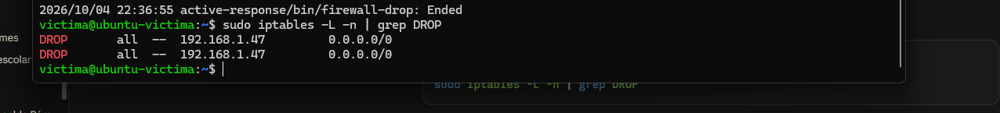
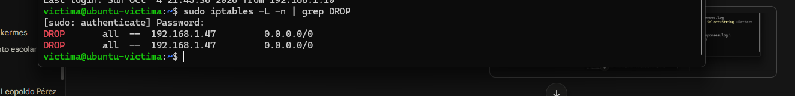

# Case 04: Active Response — Automated SSH Brute Force Containment

    

---

## Case at a Glance

| Field | Detail |
|---|---|
| **Victim host** | `ubuntu-victima` (192.168.1.46), Ubuntu 26.04 LTS, OpenSSH 10.2p1 |
| **Attacker host** | Kali Linux (192.168.1.47), hydra 9.7 |
| **Severity** | High (containment case; underlying detection bug was a High-severity blind spot) |
| **Goal** | Automated, reversible, scoped containment of SSH brute-force attacks via Wazuh Active Response |
| **Key finding** | A real, previously undocumented detection gap: OpenSSH 9.8+'s `sshd-session` log format silently breaks Wazuh's stock brute-force detection chain |
| **Detections/response built** | 2 custom decoders, 3 custom rules (`100008`, `100009`, `100041`), 1 Active Response binding |
| **Public disclosure** | Reported upstream as [wazuh/wazuh#39954](https://github.com/wazuh/wazuh/issues/39954) |
| **Related case** | Case 01 (original brute-force detection, rule `100010` extended here). Same native-decoder-vs-raw-log-format lesson as Case 02/03 recurs here with OpenSSH 9.8+ |

---

## Response Flow

```
hydra brute force              Detection attempt FAILS          Root-cause diagnosis
(17 attempts, 4 threads)   →   (rule 100010 chain never    →    (wazuh-logtest reveals
                                 fires — silent gap)               srcip never extracted)
                                                                         ↓
                                                                OpenSSH 9.8+ changed
                                                                sshd → sshd-session,
                                                                decoder regex mismatch
                                                                         ↓
                                                              Custom decoder + rules
                                                              built (100008/100009/100041)
                                                                         ↓
                                                         Active Response misfires again
                                                         (ossec.conf reset on restart —
                                                          bind-mount from host overwrote it)
                                                                         ↓
                                                              Edited host-side source file;
                                                              added missing <expect>srcip</expect>
                                                                         ↓
                                                         CONFIRMED LIVE: attack → detect →
                                                         correlate → firewall-drop → block →
                                                         auto-unblock after 600s timeout
```

---

## Contents

1. [Overview](#overview)
2. [Scenario](#scenario)
3. [Objectives](#objectives)
4. [Executive Summary](#executive-summary)
5. [Data Sources](#data-sources)
6. [Raw Event Timeline](#raw-event-timeline)
7. [Investigation](#investigation)
8. [MITRE ATT&CK Mapping](#mitre-attck-mapping)
9. [Incident Severity](#incident-severity)
10. [Response Actions](#response-actions)
11. [Detection & Response Rules](#detection--response-rules)
12. [Screenshots](#screenshots)
13. [Known Gaps / Pending Validation](#known-gaps--pending-validation)
14. [Final Conclusion](#final-conclusion)
15. [Skills Demonstrated](#skills-demonstrated)
16. [Disclaimer](#disclaimer)

---

## Overview

This case documents building automated, reversible containment for SSH brute-force attacks using Wazuh Active Response — and the real detection-engineering troubleshooting required to make it actually work. What started as a straightforward Active Response configuration (`firewall-drop` bound to the existing brute-force rule `100010`) uncovered a genuine, undocumented gap: the target host's OpenSSH version (9.8+) changed its log format in a way that silently breaks Wazuh's built-in brute-force detection chain. Closing that gap, then debugging a second, unrelated infrastructure issue (a Docker bind-mount silently reverting manual config changes), was most of the actual work. The finding was significant enough to report upstream to the Wazuh project itself.

This is the second time this lab has hit the same underlying lesson documented in Case 02 and Case 03: a native Wazuh decoder covers one specific log format, and a format change upstream (here, OpenSSH itself; there, `audisp-syslog`'s raw EXECVE records vs. `auth.log`) silently breaks the detection chain with no error anywhere. The fix pattern is the same each time — stop depending on `if_sid`/the native decoder, and match the raw log text directly.

## Scenario

- **Victim host**: `ubuntu-victima`, Ubuntu 26.04 LTS, OpenSSH 10.2p1 Ubuntu-2ubuntu3.6, IP `192.168.1.46`, registered as Wazuh agent `001`.
- **Attacker host**: Kali Linux, IP `192.168.1.47`, using `hydra` against SSH with a local wordlist (`passwords.txt`).
- **Wazuh manager**: Docker container (`single-node-wazuh.manager-1`, Wazuh 4.8.0), deployed via the official `wazuh-docker/single-node` docker-compose.
- **Starting condition**: existing brute-force detection rule (`100010`, from Case 01) assumed to be working; goal was to add automated containment on top of it.

## Objectives

1. Configure Wazuh Active Response (`firewall-drop`) bound to the existing SSH brute-force rule, with a bounded, reversible timeout — not a permanent block.
2. Validate the full pipeline live, end-to-end, with a real attack — not just configuration review.
3. Diagnose and fix any gap found, rather than accepting a partial or silently-broken result.
4. Document the containment design and the detection-engineering decisions behind it (why Active Response at the SIEM layer, not a SOAR playbook) for the tiered-response architecture of this SOC.
5. Report any upstream product gap found, with a proposed fix, back to the Wazuh open source project.

## Executive Summary

The Active Response configuration itself (`firewall-drop` bound to rule `100010`, scoped to the originating agent, with a 600-second timeout) was correct from the start. Live testing against it, however, revealed that the underlying detection never fired at all: `hydra` generated real failed-login traffic, but no brute-force alert was ever raised.

Root-causing this with `wazuh-logtest` showed the actual failure: the victim's OpenSSH version (9.8+, shipped with Ubuntu 24.04+) renamed its session-handling process from `sshd` to `sshd-session` and changed its auth-failure log format. Wazuh's stock decoders still expect the classic `Failed password for X from Y port Z` line; the new format (`Connection closed by invalid user X Y port Z [preauth]`) matches none of them, so `srcip` is never extracted and the brute-force correlation chain (`5716` → `5760` → `100010`) never fires. This is not Wazuh behaving incorrectly — it's a real gap in the shipped ruleset against a newer OpenSSH, and it fails **silently**, with no error anywhere.

Two custom decoders and two base rules were built to extract `srcip`/`srcuser` from the new log format, feeding a new correlation rule (`100041`) calibrated against the real pacing OpenSSH's own connection-penalty system allows an attacker. Once detection was confirmed working, the Active Response still didn't fire — a second, unrelated issue: the manager's `ossec.conf` is bind-mounted from a host file (`wazuh_manager.conf`) that the container's entrypoint re-copies over any in-container edit on every restart, silently discarding manual `docker cp` changes. The fix was editing the real host-side source file instead. A final missing `<expect>srcip</expect>` field in the Active Response command definition was the last blocker — without it, `wazuh-execd` has no field to extract for the script and silently never dispatches.

With all four issues fixed, the full pipeline was confirmed live: a real `hydra` attack was detected, correlated, contained (`iptables` DROP on the attacker's IP, confirmed by a failed SSH connection attempt from Kali), and automatically reverted after the 600-second timeout — all independently verified in logs and in the Wazuh dashboard (`Host Unblocked by firewall-drop Active Response`).

The decoder/rules gap was reported upstream to the Wazuh project as [issue #39954](https://github.com/wazuh/wazuh/issues/39954), with the proposed fix included, since it affects any Wazuh deployment monitoring a host running OpenSSH 9.8+ (Ubuntu 24.04+, Debian 13+, and others).

## Data Sources

| Source | What it provides |
|---|---|
| `/var/log/auth.log` (victim) | Raw SSH authentication events, ingested via Wazuh `<localfile>` |
| `wazuh-logtest` | Direct decoder/rule testing against real captured log lines — the primary diagnostic tool for this case |
| `/var/ossec/logs/active-responses.log` (**on the agent**, not the manager) | Ground truth for whether Active Response actually executed |
| `/var/ossec/logs/alerts/alerts.log` (manager) | Alert counts per rule ID, used to isolate detection vs. correlation vs. response failures |
| `iptables -L -n` (victim) | Ground truth for whether the containment action actually took effect |
| Wazuh dashboard (`Discover`) | Final live confirmation of both the block and the automatic unblock event |
| `docker inspect` | Revealed the host bind-mount responsible for `ossec.conf` silently reverting |

## Raw Event Timeline

| Step | Action | Outcome |
|---|---|---|
| 1 | Active Response configured, bound to rule `100010` | Config written, manager restarted |
| 2 | `hydra` launched against victim SSH | 0 brute-force alerts generated — silent detection failure |
| 3 | `wazuh-logtest` against a real captured auth-failure line | Decoded as generic `sshd` parent only, no `srcip`/`srcuser` extracted |
| 4 | Diagnosed OpenSSH 9.8+ `sshd-session` format mismatch against `0310-ssh_decoders.xml` | Root cause confirmed |
| 5 | Built local decoders (`sshd-session-closed-invalid`/`-valid`) + base rules `100008`/`100009` | `wazuh-logtest` confirmed correct decoding and rule match |
| 6 | Built correlation rule `100041` (initially `frequency=6`, matching the legacy `100010`) | Never reached threshold — OpenSSH's own connection-penalty system throttles `hydra` faster than 6 failures/20s |
| 7 | Recalibrated to `frequency=4`, then `frequency=3`, timeframe `30s`, against real observed attack pacing | Rule `100041` fired correctly |
| 8 | Active Response still didn't execute despite the alert firing | `active-responses.log` empty on manager |
| 9 | Diagnosed: `location: local` logs to the **agent's** `active-responses.log`, not the manager's | Checked the correct file — still empty |
| 10 | Diagnosed: `ossec.conf` reset to its pre-edit state on every `docker restart` | `docker inspect` revealed a host bind-mount (`wazuh_manager.conf`) overwriting it |
| 11 | Edited the real host-side source file instead of the in-container copy | `active-response` block confirmed persisting across restarts |
| 12 | Active Response still silently didn't dispatch | Missing `<expect>srcip</expect>` in the `<command>` definition — added it |
| 13 | Full attack relaunched | `firewall-drop add` confirmed in agent's `active-responses.log`, IP confirmed DROP'd in `iptables`, Kali SSH connection confirmed timing out |
| 14 | Waited for the 600s timeout | `firewall-drop delete` confirmed in logs; IP confirmed removed from `iptables`; Wazuh dashboard showed "Host Unblocked by firewall-drop Active Response" |
| 15 | Root cause reported upstream | [wazuh/wazuh#39954](https://github.com/wazuh/wazuh/issues/39954) opened with full repro, logs, and proposed decoder fix |

## Investigation

### Why the brute-force rule never fired

`wazuh-logtest` against a real line from the victim's `auth.log`:

```
2026-10-04T21:16:45.534812+00:00 ubuntu-victima sshd-session[1972]: PAM 4 more authentication failures; logname= uid=0 euid=0 tty=ssh ruser= rhost=192.168.1.47
```

returned:

```
**Phase 2: Completed decoding.
        name: 'sshd'
**Phase 3: Completed filtering (rules).
        id: '2502'
        description: 'syslog: User missed the password more than one time'
```

No `srcip` was extracted at all — the event decoded only against the generic parent `sshd` decoder and matched a generic PAM rule (`2502`), not the SSH-specific chain. Comparing against the shipped `0310-ssh_decoders.xml` confirmed every child decoder under `sshd` expects message patterns tied to the classic `sshd[PID]: Failed password for...` format — none match `sshd-session`'s `Connection closed by invalid user X Y port Z [preauth]` or `PAM N more authentication failures; ... rhost=X` lines, which OpenSSH 9.8+ introduced when it split privilege-separation into `sshd` + `sshd-session` processes.

This is a real, reproducible gap — confirmed against the official ruleset source, and already partially acknowledged by the Wazuh team for the macOS logging path ([PR #37769](https://github.com/wazuh/wazuh/pull/37769)), but not yet covered for standard Linux syslog ingestion.

### Building the fix: decoder + rules

The fix adds two decoders as children of the existing `sshd` parent decoder, extracting `srcuser`/`srcip`/`srcport` from the new message formats, plus two base rules and a correlation rule. Full definitions in [Detection & Response Rules](#detection--response-rules).

A subtle bug surfaced while building this: a child decoder's matched name is **not** reported to downstream rules via `<decoded_as>` unless `<use_own_name>true</use_own_name>` is explicitly set — without it, `wazuh-logtest` still shows the *parent's* name (`sshd`), and any rule relying on `<decoded_as>sshd-session-closed-invalid</decoded_as>` silently never matches, even though the regex extraction itself works correctly. This cost a full diagnostic cycle before being caught.

### Calibrating the correlation threshold against real attack pacing

The first version of rule `100041` reused the legacy threshold (`frequency=6`, `timeframe=20s`) from rule `100010`. It never fired. Comparing alert counts for the base rule (`100008`) before and after each attack run showed only 3-4 qualifying events landing within the window per `hydra` run — not 6. The cause: OpenSSH's own `PerSourcePenalties` connection-rate-limiting (visible in `auth.log` as `srclimit_penalise... activating ipv4 penalty`) throttles repeated connection attempts from the same source IP, meaning the attacker's own defenses were outpacing Wazuh's correlation window. The threshold was recalibrated to `frequency=3`, `timeframe=30s`, matching the real pacing an attacker can achieve against this hardened SSH configuration — a deliberate trade-off between detection speed and avoiding a threshold that could never realistically be reached.

### The ossec.conf bind-mount trap

After confirming detection worked, the Active Response still never executed, and `/var/ossec/logs/active-responses.log` (checked on the **manager**) was empty. Two root causes were layered here:

1. **Wrong log file.** With `<location>local</location>`, the Active Response executes — and logs — on the **agent** that generated the alert, not the manager. The manager's `active-responses.log` only reflects responses the manager itself executes. This was the first false lead.
2. **Config not persisting.** Even after editing the manager's `ossec.conf` directly via `docker cp` and confirming the change with `docker exec ... tail`, the Active Response block disappeared after every `docker restart`. `docker inspect single-node-wazuh.manager-1 --format "{{json .Mounts}}"` revealed a bind mount: `wazuh_manager.conf` on the Windows host is mounted to `/wazuh-config-mount/etc/ossec.conf`, and the container's entrypoint re-copies it over `/var/ossec/etc/ossec.conf` on every start — silently discarding any direct in-container edit. The fix was editing the real host-side source file instead of the in-container copy.

### The missing `<expect>` field

With the correct source file edited and persisting, the Active Response *still* didn't dispatch — `wazuh-analysisd` logged a successful connection to the active-response queue, but never wrote to it. The `<command>` definition was missing `<expect>srcip</expect>`, which tells `wazuh-execd` which field to extract from the alert and pass to the script. Without it, there is no documented field to pass, and dispatch is silently skipped — no error, no warning. Adding it was the final fix.

## MITRE ATT&CK Mapping

| Phase | Technique | ID | Tactic | Evidence | Confidence |
|---|---|---|---|---|---|
| Credential access | Brute Force: Password Guessing | T1110.001 | Credential Access | Rule `100041`, confirmed firing live against real `hydra` traffic | High |
| Response (defensive) | N/A — containment action, not an attacker technique | — | — | Active Response `firewall-drop`, confirmed blocking and auto-reverting | High |

## Incident Severity

**Classification: High.**

Rationale: the underlying issue is not a single misconfiguration but a systemic detection blind spot — any Wazuh deployment monitoring a host with OpenSSH 9.8+ (a growing share of deployments, given Ubuntu 24.04+ and Debian 13+ now ship it by default) silently loses SSH brute-force detection and any Active Response built on top of it, with zero indication anything is wrong. The compounding Docker bind-mount issue meant even a correctly-diagnosed fix could silently fail to persist, which is itself a secondary operational risk worth documenting for anyone running the official `wazuh-docker` compose files.

## Response Actions

1. **Detection**: custom decoders + rules built to restore brute-force detection coverage for OpenSSH 9.8+ hosts (`100008`, `100009`, `100041`).
2. **Containment**: Wazuh Active Response (`firewall-drop`), scoped to the originating agent (`location: local`), bound to both the legacy (`100010`) and new (`100041`) brute-force rules, with a 600-second timeout — automated, reversible, and narrowly targeted at the attacking IP only.
3. **Validation**: full pipeline confirmed live end-to-end — attack, detection, correlation, block, and automatic unblock — independently verified via agent-side logs, `iptables`, and the Wazuh dashboard.
4. **Upstream reporting**: the root-cause ruleset gap was reported to the Wazuh project ([#39954](https://github.com/wazuh/wazuh/issues/39954)) with full reproduction steps and a proposed fix, so the gap doesn't silently persist for other users of the product.
5. **Operational note for future deployments**: any manual `ossec.conf` edit on this lab's manager must go through the host-side `wazuh_manager.conf` file, not `docker cp` into the running container, or it will be silently discarded on the next restart.

## Detection & Response Rules

**Local decoders** (`/var/ossec/etc/decoders/local_decoder.xml`):

```xml
<decoder name="sshd-session-closed-invalid">
  <parent>sshd</parent>
  <use_own_name>true</use_own_name>
  <prematch>^Connection closed by invalid user </prematch>
  <regex offset="after_prematch">^(\S+) (\S+) port (\d+)</regex>
  <order>srcuser, srcip, srcport</order>
</decoder>

<decoder name="sshd-session-closed-valid">
  <parent>sshd</parent>
  <use_own_name>true</use_own_name>
  <prematch>^Connection closed by authenticating user </prematch>
  <regex offset="after_prematch">^(\S+) (\S+) port (\d+)</regex>
  <order>srcuser, srcip, srcport</order>
</decoder>
```

**Local rules** (`/var/ossec/etc/rules/local_rules.xml`):

```xml
<group name="local,syslog,sshd,">

  <rule id="100008" level="5">
    <decoded_as>sshd-session-closed-invalid</decoded_as>
    <description>sshd: authentication failed for invalid user $(srcuser) from $(srcip) (new OpenSSH format)</description>
    <group>authentication_failed,ssh_auth_fail_new,pci_dss_10.2.4,pci_dss_10.2.5,</group>
  </rule>

  <rule id="100009" level="5">
    <decoded_as>sshd-session-closed-valid</decoded_as>
    <description>sshd: authentication failed for user $(srcuser) from $(srcip) (new OpenSSH format)</description>
    <group>authentication_failed,ssh_auth_fail_new,pci_dss_10.2.4,pci_dss_10.2.5,</group>
  </rule>

</group>

<group name="local,syslog,sshd,">

  <rule id="100010" level="10" frequency="6" timeframe="20" ignore="180">
    <if_matched_sid>5760</if_matched_sid>
    <same_source_ip />
    <description>sshd: Possible brute force attack. 6 or more failed logins from the same source IP within 20 seconds.</description>
    <mitre>
      <id>T1110.001</id>
    </mitre>
  </rule>

  <rule id="100041" level="10" frequency="3" timeframe="30" ignore="180">
    <if_matched_group>ssh_auth_fail_new</if_matched_group>
    <same_source_ip />
    <description>sshd: Possible brute force attack (new OpenSSH format). 3 or more failed logins from the same source IP within 30 seconds.</description>
    <mitre>
      <id>T1110.001</id>
    </mitre>
  </rule>

</group>
```

**Active Response** (host-side `wazuh_manager.conf`, not edited directly in-container — see Investigation):

```xml
<command>
  <name>firewall-drop-ssh-bruteforce</name>
  <executable>firewall-drop</executable>
  <expect>srcip</expect>
  <timeout_allowed>yes</timeout_allowed>
</command>

<active-response>
  <command>firewall-drop-ssh-bruteforce</command>
  <location>local</location>
  <rules_id>100010,100041</rules_id>
  <timeout>600</timeout>
</active-response>
```

**Live confirmation** (agent-side `/var/ossec/logs/active-responses.log`):

```
2026/10/04 22:36:55 active-response/bin/firewall-drop: Starting
2026/10/04 22:36:55 active-response/bin/firewall-drop: {"command":"add", ... "rule":{"id":"100041", ...}, "data":{"srcip":"192.168.1.47", ...}}
2026/10/04 22:36:55 active-response/bin/firewall-drop: Ended
```

`iptables -L -n` on the agent confirmed the DROP rule for `192.168.1.47` was added, and a subsequent `ssh` attempt from the attacker host timed out while the block was active. After the 600s timeout, the Wazuh dashboard logged **"Host Unblocked by firewall-drop Active Response"** (rule `652`), and the `iptables` rule was confirmed removed.

**SIEM-agnostic version**: converted to **Sigma** format — see [`detection-rules/sigma/`](detection-rules/sigma/).

## Screenshots

**`iptables` DROP rule confirmed on the agent** — both bound rules (`100010`, `100041`) triggered the same Active Response, producing two `DROP` entries for `192.168.1.47`:




**Automatic unblock after the 600s timeout**, confirmed in the Wazuh dashboard (`Discover`):


## Known Gaps / Pending Validation

- **Upstream fix not yet merged.** [#39954](https://github.com/wazuh/wazuh/issues/39954) is open as of this writing; the local decoder/rule workaround is what's actually deployed, not the upstream ruleset. A follow-up Pull Request with the fix integrated into `0310-ssh_decoders.xml` is planned once initial maintainer feedback is received.
- **`frequency=3` on rule `100041` is tuned to this specific lab's observed OpenSSH penalty pacing.** A production deployment should re-validate this threshold against its own environment — a faster or slower attacker, or a different `PerSourcePenalties` configuration, could shift the realistic achievable frequency within the correlation window.
- **Legacy rule `100010` (classic format) was left in place but not re-validated against a host running older OpenSSH** in this case — it's assumed still functional based on Case 01, not re-confirmed here.

## Final Conclusion

This case started as a routine Active Response configuration task and surfaced a genuine, previously unreported product gap: Wazuh's shipped SSH decoders silently stop detecting brute-force attacks against any host running OpenSSH 9.8+, a version now shipping by default on current LTS distributions. Diagnosing this required working methodically through `wazuh-logtest` rather than assuming the Active Response configuration itself was at fault, and two further infrastructure issues (a Docker bind-mount silently reverting config, a missing `<expect>` field) had to be found and fixed before the full pipeline could be validated live. The gap was significant enough — and general enough — to report upstream with a proposed fix rather than keep it as a private workaround, which is the kind of contribution that only comes from validating a security control end-to-end instead of trusting it once it's configured.

## Skills Demonstrated

- Root-causing a silent detection failure through systematic isolation (hydra → decoder → rule → correlation → dispatch → execution), rather than assuming the most recently configured piece was at fault
- Direct use of `wazuh-logtest` as the primary diagnostic tool, rather than trial-and-error live testing
- Recognizing and working around an undocumented Wazuh decoder behavior (`<use_own_name>`) through controlled, reproducible testing
- Calibrating a detection threshold against real observed attacker-side constraints (OpenSSH's own rate-limiting) instead of an assumed default
- Diagnosing a Docker/infrastructure issue (bind-mount overwrite) that masked a security-configuration problem as a detection problem
- Recognizing when a finding has value beyond a single lab environment, and contributing it upstream to the relevant open source project with a full reproduction and a proposed fix
- End-to-end validation discipline: never declaring a security control "done" from configuration alone — confirming detection, correlation, response, and reversal all independently, in logs and in the product UI

## Disclaimer

This is a **real, deliberately executed** containment exercise in an isolated home lab, for educational and portfolio purposes. None of the machines or data involved belong to a third party or a production environment. All attack traffic was generated against infrastructure owned and controlled by the author. The upstream issue report ([#39954](https://github.com/wazuh/wazuh/issues/39954)) discloses a ruleset/detection gap, not a security vulnerability in Wazuh itself, and was filed through the public Issues tracker per Wazuh's own security policy, which reserves private disclosure for vulnerabilities that could compromise Wazuh itself.
